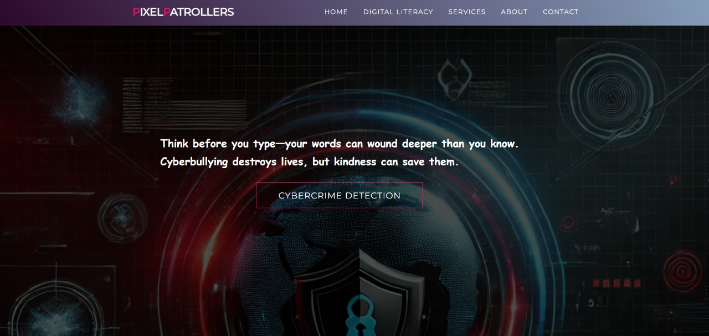

Pixel Patrollers
Pixel Patrollers – AI Eyes on Every Pixel, Patrolling to Protect Your Digital World.
About the Project

With the rise of cyber threats, online harassment, and misinformation, digital safety has become more important than ever. Pixel Patrollers is an AI-driven solution designed to detect cyberbullying, deepfake content, and misinformation using cutting-edge machine learning models. Our goal is to provide a safer and more trustworthy online environment for individuals and businesses.

🌟 Features

Cyberbullying Detection – AI analyzes text to identify harmful or abusive language.

Deepfake Detection – Detects manipulated images to prevent misinformation.

Misinformation Detection – (Upcoming) Uses Gemini API to verify content authenticity.

Multilingual Support – Detects harmful content in English and Hinglish (expanding soon).

Voice & Audio Analysis – (Future) Identifies deepfake voices and harmful audio content.

Business Integration – Platforms like Instagram and social networks can embed our tool for automated moderation.

🖥️ Tech Stack

Frontend:

HTML, CSS, JavaScript

Responsive design for web and mobile

Backend:

Flask, TensorFlow, OpenCV

Scikit-learn, TF-IDF Vectorization, Decision Tree Classifier

Google Colab for AI model training
## 📷 Screenshots

📈 Future Scope

Deepfake Video Detection – Analyze fake videos along with images.

Improved Misinformation Detection – Validate news and social content.

AI for Voice & Audio Deepfakes – Detect fake voices and harmful speech.

Integration with Social Media & Businesses – Allow platforms to embed our detection tool.

Legal Structuring for Cyber Forensics – Make it legally compliant for investigations.

🔗 Deployment

The website is currently under development for public hosting. Stay tuned for the official launch!

